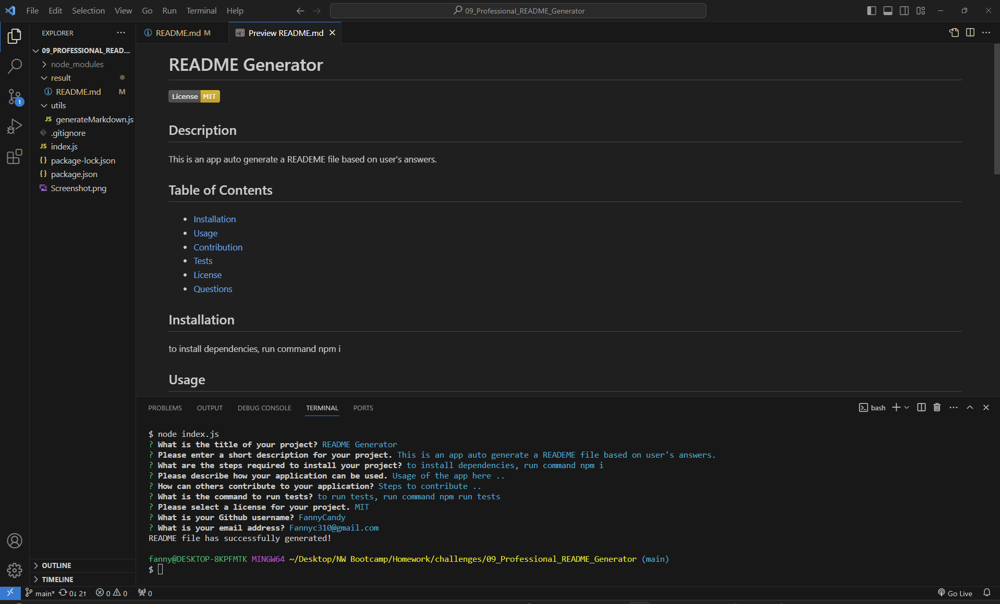

# Professional README Generator 

## Description
This is an app auto generate a READEME file based on user's answers.

## Screenshot

## GitHub Link
https://github.com/FannyCandy/09_Professional_README_Generator

## Demo video
https://drive.google.com/file/d/19uugzbBtxOmvoCe2ZAMNPqcPnsj8txI3/view?usp=drive_link

## Credits
- Markdown License badges by [Lukas Himsel](https://gist.github.com/lukas-h) : https://gist.github.com/lukas-h/2a5d00690736b4c3a7ba